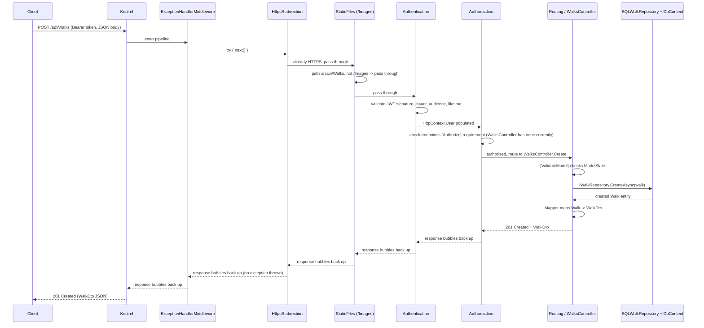

# 02 — Program.cs & Middleware Pipeline

`NZWalks.API/Program.cs` is the composition root: it has two distinct halves, in this order:

1. **DI container configuration** — `builder.Services.Add...` calls, which register *what exists* (but don't run yet).
2. **HTTP pipeline configuration** — `app.Use...` / `app.Map...` calls, which define *what runs, in what order,* for every incoming request.

Both halves are documented below in the exact order they appear in the file, followed by a concrete request walkthrough.

## 1. DI container configuration (`builder.Services.Add...`)

| # | Call | What it does | Why it's here |
|---|---|---|---|
| — | `LoggerConfiguration()` → `builder.Logging.ClearProviders()` + `AddSerilog(logger)` | Serilog sinks: Console + daily-rolling file (`Logs/NZWalksLog.txt`), minimum level Information | Runs *before* `builder.Services.Add...` because logging needs to be wired into the host before anything else starts logging during startup |
| 1 | `AddControllers()` | Registers MVC controller support | Baseline — everything else builds on routing/controllers existing |
| 2 | `AddApiVersioning(...).AddApiExplorer(...)` | Default version 1.0, assumes default when unspecified, reports supported versions in response headers, groups Swagger docs as `'v'VVV` | Needed before Swagger generation, since Swagger needs to know about versions to generate one doc per version |
| 3 | `AddHttpContextAccessor()` | Registers `IHttpContextAccessor` | Required by `LocalImageRepository` to build the public URL of an uploaded image outside of a controller context |
| 4 | `AddEndpointsApiExplorer()` | Minimal-API-style endpoint metadata for Swagger | Paired with `AddSwaggerGen` |
| 5 | `AddSwaggerGen(...)` | Adds a JWT Bearer security definition + requirement so Swagger UI can send `Authorization: Bearer <token>` | Lets Swagger UI test authenticated endpoints directly |
| 6 | `ConfigureOptions<ConfigureSwaggerOptions>()` | Registers the class that creates one Swagger doc per discovered API version | Depends on `AddApiVersioning` having run first |
| 7 | `AddDbContext<NZWalksDbContext>(...)` | SQL Server via `NZWalksConnectionString` | Main data (Regions, Walks, Difficulties, Images) |
| 8 | `AddDbContext<NZWalksAuthDbContext>(...)` | SQL Server via `NZWalksAuthConnectionString` | Separate database for Identity (users/roles), isolated from app data |
| 9–12 | `AddScoped<IRegionRespository, SQLRegionRepository>()`, `AddScoped<IWalkRepository, SQLWalkRepository>()`, `AddScoped<ITokenRepository, TokenRepository>()`, `AddScoped<IImageRepository, LocalImageRepository>()` | Wires each repository interface to its concrete implementation | `Scoped` matches the DbContext lifetime — one instance per HTTP request |
| 13 | `AddAutoMapper(cfg => cfg.AddProfile<AutoMapperProfiles>())` | Registers the single mapping profile | Used by controllers via `IMapper` |
| 14 | `AddIdentityCore<IdentityUser>().AddRoles<IdentityRole>().AddTokenProvider<DataProtectorTokenProvider<IdentityUser>>("NZWalks").AddEntityFrameworkStores<NZWalksAuthDbContext>().AddDefaultTokenProviders()` | Registers ASP.NET Core Identity (users + roles), backed by `NZWalksAuthDbContext` | Needed before `AddAuthentication`, since the JWT bearer scheme validates against Identity-issued claims |
| 15 | `Configure<IdentityOptions>(...)` | Password policy: non-alphanumeric required, digit required, min length 8, min unique chars 1 | Governs `UserManager.CreateAsync` validation in `AuthController.Register` |
| 16 | `AddAuthentication(JwtBearerDefaults.AuthenticationScheme).AddJwtBearer(...)` | Sets JWT Bearer as the default auth scheme; configures `TokenValidationParameters` (validate issuer/audience/lifetime/signing key, using `Jwt:Issuer`/`Jwt:Audience`/`Jwt:Key` from config) | Last, because it depends on Identity being registered above |

**Note:** `Jwt:ExpiryMinutes` is present in `appsettings.json` but never actually read here or in `TokenRepository` — see finding #11 in the tech-debt doc.

## 2. HTTP pipeline configuration (`app.Use...` / `app.Map...`)

In exact order:

| # | Middleware | What it does | Why it's positioned here |
|---|---|---|---|
| 1 | `if (Environment.IsDevelopment()) { UseSwagger(); UseSwaggerUI(...); }` | Serves `/swagger/{version}/swagger.json` and the Swagger UI, one endpoint per API version | Dev-only — never exposed in production; must run before routing since it serves its own endpoints outside `MapControllers` |
| 2 | `UseMiddleware<ExceptionHandlerMiddleware>()` | Wraps everything downstream in a try/catch; on exception, logs it and returns a JSON 500 | Placed as early as possible (right after the dev-only Swagger block) so it can catch exceptions thrown by *every* middleware and controller below it — HTTPS redirection, static files, auth, and the controller action itself |
| 3 | `UseHttpsRedirection()` | Redirects HTTP → HTTPS | Runs before anything that would otherwise process a plaintext request |
| 4 | `UseStaticFiles(new StaticFileOptions { FileProvider = PhysicalFileProvider(.../Images), RequestPath = "/Images" })` | Serves uploaded images directly from disk at `/Images/*` | Deliberately placed **before** `UseAuthentication`/`UseAuthorization` — uploaded images are publicly viewable without a token, by design (e.g. an `` tag doesn't carry an `Authorization` header) |
| 5 | `UseAuthentication()` | Reads the `Authorization: Bearer <token>` header, validates it against the `TokenValidationParameters` configured above, and populates `HttpContext.User` if valid | Must run **before** `UseAuthorization` — authorization needs `HttpContext.User` to already be populated to evaluate role checks |
| 6 | `UseAuthorization()` | Evaluates `[Authorize]` / `[Authorize(Roles=...)]` attributes on the matched endpoint against `HttpContext.User` | Must run **after** `UseAuthentication` and **before** the request reaches a controller action |
| 7 | `MapControllers()` | Routes the request to the matching controller action | Last — by this point the request has passed through logging, exception wrapping, HTTPS enforcement, static file short-circuit (if applicable), authentication, and authorization |
| 8 | `Run()` | Starts the Kestrel server | — |

**Notable gap:** there is no `AddCors()` / `UseCors()` anywhere in the pipeline — see finding #4 in the tech-debt doc.

## 3. Request traversal — worked example

Example request: `POST /api/Walks` with header `Authorization: Bearer <jwt>`.

### Step-by-step narrative

1. **Kestrel** accepts the TCP connection and hands the request to the ASP.NET Core middleware pipeline.
2. **`ExceptionHandlerMiddleware`** wraps everything that follows in a try/catch. It calls `next()` and waits — if anything downstream throws, control returns here (see failure path below).
3. **`UseHttpsRedirection`** confirms the request is already HTTPS and passes through unchanged.
4. **`UseStaticFiles`** checks whether the request path starts with `/Images`. It doesn't (`/api/Walks`), so this middleware is a no-op pass-through.
5. **`UseAuthentication`** reads the `Authorization` header, validates the JWT (issuer, audience, lifetime, signing key against `Jwt:Key`), and — if valid — populates `HttpContext.User` with the claims embedded in the token (email + role, per `TokenRepository`).
6. **`UseAuthorization`** checks the matched endpoint's authorization requirements against `HttpContext.User`. `WalksController` currently has no `[Authorize]` attribute at all (see finding #8), so any authenticated *or unauthenticated* request passes this stage for `/api/Walks`.
7. **Routing** dispatches to `WalksController.Create`. The `[ValidateModel]` action filter checks `ModelState` first and short-circuits with `400 Bad Request` if the `AddWalkDto` fails validation.
8. The controller calls `IWalkRepository.CreateAsync`, which `SQLWalkRepository` fulfills against `NZWalksDbContext`.
9. `IMapper` maps the resulting `Walk` entity to a `WalkDto`, and the controller returns `201 Created`.
10. The response bubbles back up through the same middleware stack in reverse — each middleware gets a chance to inspect/modify the outgoing response — until Kestrel sends it to the client.

### Failure paths

- **Missing/invalid/expired JWT:** `UseAuthentication` simply fails to populate `HttpContext.User` (or populates it as unauthenticated) — the request still proceeds to `UseAuthorization`. If the target action requires `[Authorize]`, authorization rejects it with `401 Unauthorized` (no token) or `403 Forbidden` (valid token, wrong role) *before* the controller action ever runs. Since `WalksController` has no `[Authorize]` today, this specific example wouldn't actually be rejected — see finding #8.
- **Controller throws an unhandled exception** (e.g. a database connectivity failure in `SQLWalkRepository`): the exception propagates up through routing, authorization, authentication, and static files, and is caught by `ExceptionHandlerMiddleware`'s `catch` block. It logs the exception via `ILogger` and writes a `500` JSON response `{ Id, ErrorMessage }` — though see finding #1, the `Id` is currently always `Guid.Empty` rather than a unique correlation id.
- **`ModelState` invalid** (e.g. missing required field on `AddWalkDto`): `[ValidateModel]` short-circuits with `400 Bad Request` before the repository is ever called — this happens *inside* the controller/action-filter stage, after all pipeline middleware has already passed the request through.

## 4. JWT / Identity configuration summary

- **Scheme:** `JwtBearerDefaults.AuthenticationScheme` ("Bearer") is the sole/default authentication scheme.
- **Token validation:** issuer, audience, lifetime, and signing key are all validated (`ValidateIssuer/Audience/Lifetime/IssuerSigningKey = true`), sourced from `Jwt:Issuer`, `Jwt:Audience`, `Jwt:Key` in configuration.
- **Password policy:** non-alphanumeric required, digit required, minimum length 8, minimum unique characters 1 — enforced by `IdentityOptions` against `UserManager.CreateAsync`.
- **Role seeding:** roles are **not** seeded at runtime by a `DbInitializer`/seeder class. They're inserted via an EF Core migration (`Migrations/NZWalksAuthDb/..._Creating Auth Db.cs`), which applies `HasData` on fixed GUIDs for `Reader`, `Writer`, `Admin` roles defined in `NZWalksAuthDbContext.OnModelCreating`. This means the roles exist in the database the moment `dotnet ef database update` is run — there is no code path that creates them lazily at app startup.
- **Role assignment:** happens at registration time in `AuthController.Register`, which calls `userManager.AddToRoleAsync(identityUser, registerRequestDto.Roles[0])` — only the first submitted role is applied (see finding #9).
